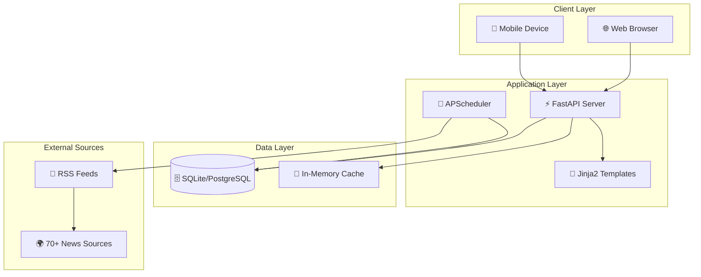

<div align="center">

# 🌍 GeoPolitics Watch

### Your Window to World Geopolitics

[](https://python.org)
[](https://fastapi.tiangolo.com)
[](LICENSE)
[](https://railway.app)

A production-ready news aggregator web application focused on world geopolitics, featuring **70+ news sources**, real-time updates, and a beautiful responsive interface.

[**🚀 Live Demo**](https://geopolitics-news-production.up.railway.app) • [**📖 Documentation**](#api-endpoints) • [**🐛 Report Bug**](https://github.com/hitarth0710/geopolitics-news/issues)

---

</div>

## 📸 Screenshots

<div align="center">

### 🏠 Home Page - Dark Mode

*Browse the latest geopolitical news with category and region filters*

### 🌅 Home Page - Light Mode

*Clean, readable interface with toggle between dark and light themes*

### 📰 Article Detail View

*Full article view with related articles and social sharing*

### 📱 Mobile Responsive

*Fully responsive design optimized for all screen sizes*

</div>

> **Note:** Replace the placeholder image URLs above with actual screenshots of your deployed application.

---

## ✨ Features

<table>
<tr>
<td width="50%">

### 📰 Content & Aggregation
- **70+ News Sources** - BBC, Al Jazeera, Reuters, Foreign Policy, and more
- **Auto-refresh** - Background scheduler fetches new articles every 30 minutes
- **Smart Categorization** - AI-assisted topic detection
- **Deduplication** - Intelligent duplicate article filtering

</td>
<td width="50%">

### 🎨 User Experience
- **🌓 Dark/Light Mode** - Toggle theme preference
- **📱 Responsive Design** - Mobile-first approach
- **🔍 Full-text Search** - Search across titles and summaries
- **⚡ Fast Loading** - Optimized caching layer

</td>
</tr>
<tr>
<td width="50%">

### 🔐 User Features
- **👤 User Accounts** - Register and login
- **🔖 Bookmarks** - Save articles for later
- **📚 Reading History** - Track what you've read
- **⚙️ Preferences** - Customize your feed

</td>
<td width="50%">

### 🌍 Filtering & Discovery
- **Geographic Filtering** - Americas, Europe, MENA, Asia-Pacific, Africa
- **Topic Categories** - Conflicts, Diplomacy, Trade, Elections, Climate, Tech
- **Source Filtering** - Browse by news outlet
- **Date Filtering** - Find articles by date

</td>
</tr>
</table>

---

## 🛠️ Tech Stack

<div align="center">

| Layer | Technologies |
|:---:|:---|
| **Backend** |    |
| **Frontend** |    |
| **Database** |   |
| **DevOps** |    |

</div>

### Architecture Overview



---

## 🚀 Quick Start

### Prerequisites

- Python 3.11+
- pip or pipenv
- Git

### Local Development

```bash
# Clone the repository
git clone https://github.com/hitarth0710/geopolitics-news.git
cd geopolitics-news

# Create virtual environment
python -m venv venv
source venv/bin/activate  # Linux/Mac
# or: .\venv\Scripts\activate  # Windows

# Install dependencies
pip install -r requirements.txt

# Run development server
uvicorn app.main:app --reload --port 8000
```

🎉 Visit **http://localhost:8000** to see the app!

### 🐳 Docker

```bash
# Build and run with Docker
docker build -t geopolitics-news .
docker run -p 8000:8000 geopolitics-news

# Or use Docker Compose
docker-compose up -d
```

---

## ☁️ Deployment

### Deploy to Railway (Recommended) 

[](https://railway.app/template/geopolitics-news?referralCode=hitarth)

Railway offers the easiest deployment experience with automatic HTTPS, persistent storage, and auto-deployments.

**Steps:**
1. Click the "Deploy on Railway" button above, or:
2. Fork this repository
3. Create a new project on [Railway](https://railway.app)
4. Connect your GitHub repository
5. Railway auto-detects the Dockerfile and deploys!

**Environment Variables (set in Railway dashboard):**
```env
ENVIRONMENT=production
DEBUG=false
SECRET_KEY=your-super-secret-key-here
LOG_JSON=true
FEED_UPDATE_INTERVAL=30
```

**Features on Railway:**
- ✅ Automatic HTTPS
- ✅ Persistent volumes for SQLite database
- ✅ Auto-deploy on git push
- ✅ Health check monitoring
- ✅ Zero-downtime deployments

---

### Deploy to Render

[](https://render.com/deploy?repo=https://github.com/hitarth0710/geopolitics-news)

This repo includes a `render.yaml` for easy deployment:

1. Fork this repository
2. Create a new Web Service on [Render](https://render.com)
3. Connect your GitHub repo
4. Render will auto-detect the configuration

---

### Deploy with Docker Compose (Self-hosted)

For production deployment on your own infrastructure:

```yaml
# docker-compose.prod.yml
version: '3.8'

services:
  web:
    build: .
    ports:
      - "8000:8000"
    environment:
      - ENVIRONMENT=production
      - DEBUG=false
      - SECRET_KEY=${SECRET_KEY}
      - DATABASE_URL=postgresql://user:pass@db:5432/geopolitics
    depends_on:
      - db
    restart: unless-stopped

  db:
    image: postgres:15-alpine
    environment:
      POSTGRES_USER: user
      POSTGRES_PASSWORD: pass
      POSTGRES_DB: geopolitics
    volumes:
      - postgres_data:/var/lib/postgresql/data
    restart: unless-stopped

volumes:
  postgres_data:
```

```bash
# Deploy
docker-compose -f docker-compose.prod.yml up -d
```

---

### Manual Deployment (VPS/Cloud VM)

```bash
# Clone and setup
git clone https://github.com/hitarth0710/geopolitics-news.git
cd geopolitics-news
python -m venv venv
source venv/bin/activate
pip install -r requirements.txt

# Set environment variables
export ENVIRONMENT=production
export DEBUG=false
export SECRET_KEY=$(openssl rand -hex 32)
export LOG_JSON=true

# Run with Gunicorn (production WSGI server)
gunicorn app.main:app \
  -w 4 \
  -k uvicorn.workers.UvicornWorker \
  -b 0.0.0.0:8000 \
  --timeout 120

# Optional: Use with systemd for auto-restart
# Create /etc/systemd/system/geopolitics.service
```

<details>
<summary>📄 Systemd Service File</summary>

```ini
[Unit]
Description=GeoPolitics Watch
After=network.target

[Service]
User=www-data
Group=www-data
WorkingDirectory=/opt/geopolitics-news
Environment="PATH=/opt/geopolitics-news/venv/bin"
Environment="ENVIRONMENT=production"
Environment="DEBUG=false"
ExecStart=/opt/geopolitics-news/venv/bin/gunicorn app.main:app -w 4 -k uvicorn.workers.UvicornWorker -b 0.0.0.0:8000
Restart=always

[Install]
WantedBy=multi-user.target
```

</details>

---

## 📡 API Endpoints

### Web Pages

| Endpoint | Description |
|:---------|:------------|
| `GET /` | 🏠 Home page with article listing |
| `GET /article/{id}` | 📰 Article detail page |
| `GET /about` | ℹ️ About page with source info |
| `GET /auth/login` | 🔐 Login page |
| `GET /auth/register` | 📝 Registration page |
| `GET /profile/dashboard` | 👤 User dashboard |
| `GET /profile/saved` | 🔖 Saved articles |
| `GET /profile/history` | 📚 Reading history |

### REST API

| Endpoint | Method | Description |
|:---------|:------:|:------------|
| `/api/articles/` | GET | List articles with filters |
| `/api/articles/{id}` | GET | Get article details |
| `/api/articles/categories/list` | GET | List all categories |
| `/api/articles/regions/list` | GET | List all regions |
| `/api/articles/sources/list` | GET | List all sources |
| `/api/bookmarks/` | GET | Get user's bookmarks |
| `/api/bookmarks/{id}` | POST | Add bookmark |
| `/api/bookmarks/{id}` | DELETE | Remove bookmark |
| `/api/refresh` | POST | Trigger feed refresh |

### Health & Monitoring

| Endpoint | Description |
|:---------|:------------|
| `GET /health` | Basic health check |
| `GET /health/detailed` | Detailed status with DB stats |

### Query Parameters

```bash
# Filter articles by category, region, search term, and date
GET /api/articles/?category=conflicts&region=europe&search=ukraine&date=2024-01-15&limit=20&offset=0
```

---

## ⚙️ Configuration

All configuration is done via environment variables:

| Variable | Description | Default |
|:---------|:------------|:--------|
| `ENVIRONMENT` | Environment mode | `development` |
| `DEBUG` | Enable debug mode | `false` |
| `SECRET_KEY` | Secret key for sessions | *Required in prod* |
| `DATABASE_URL` | Database connection string | `sqlite:///./geopolitics_news.db` |
| `FEED_UPDATE_INTERVAL` | Minutes between feed updates | `30` |
| `CACHE_TTL` | Cache TTL in seconds | `300` |
| `CACHE_ENABLED` | Enable caching | `true` |
| `LOG_LEVEL` | Logging level | `INFO` |
| `LOG_JSON` | Use JSON logging | `false` |
| `RATE_LIMIT_REQUESTS` | Requests per minute | `100` |

---

## 📰 News Sources (70+)

<details>
<summary><b>🌐 Global News Networks</b></summary>

| Source | Coverage |
|:-------|:---------|
| BBC World | Global |
| Al Jazeera | Global |
| Reuters | Global |
| Associated Press | Global |
| France 24 | Global |
| DW News | Europe/Global |
| NPR World | Global |
| The Guardian | Global |
| Euronews | Europe |

</details>

<details>
<summary><b>🔍 Analysis & Think Tanks</b></summary>

| Source | Focus |
|:-------|:------|
| Foreign Policy | Geopolitical Analysis |
| The Diplomat | Asia-Pacific |
| Council on Foreign Relations | Policy Analysis |
| Brookings Institution | Research |

</details>

<details>
<summary><b>🌍 Regional Sources</b></summary>

| Region | Sources |
|:-------|:--------|
| **Americas** | The Hill, Axios, Politico US |
| **Europe** | POLITICO Europe, EUObserver |
| **MENA** | Middle East Eye, Al-Monitor |
| **Asia-Pacific** | South China Morning Post, Nikkei Asia |
| **Africa** | AllAfrica, The East African |

</details>

---

## 📁 Project Structure

```
geopolitics-news/
├── 📂 app/
│   ├── 📄 main.py              # FastAPI application & routes
│   ├── 📄 settings.py          # Pydantic settings management
│   ├── 📄 database.py          # SQLAlchemy database setup
│   ├── 📄 models.py            # Database models (User, Article, etc.)
│   ├── 📄 schemas.py           # Pydantic schemas for validation
│   ├── 📄 services.py          # Business logic layer
│   ├── 📄 auth.py              # Authentication & session management
│   ├── 📄 cache.py             # In-memory caching layer
│   ├── 📄 middleware.py        # Security & CORS middleware
│   ├── 📄 exceptions.py        # Custom exception handlers
│   ├── 📄 logging_config.py    # Structured logging setup
│   ├── 📂 feeds/
│   │   ├── 📄 sources.py       # RSS feed configurations (70+ sources)
│   │   └── 📄 rss_parser.py    # Async RSS parsing & categorization
│   ├── 📂 routes/
│   │   ├── 📄 articles.py      # Article API routes
│   │   ├── 📄 auth_routes.py   # Authentication routes
│   │   ├── 📄 profile_routes.py # User profile routes
│   │   └── 📄 bookmarks.py     # Bookmark management
│   └── 📂 templates/           # Jinja2 HTML templates
│       ├── 📄 index.html
│       ├── 📄 article.html
│       ├── 📂 auth/
│       └── 📂 profile/
├── 📂 static/
│   └── 📂 css/
│       └── 📄 responsive.css   # Custom responsive styles
├── 📂 tests/
│   └── 📄 test_app.py          # Pytest test suite
├── 🐳 Dockerfile               # Multi-stage Docker build
├── 🐳 docker-compose.yml       # Docker Compose configuration
├── 🚂 railway.json             # Railway deployment config
├── 🎨 render.yaml              # Render deployment config
├── 📋 requirements.txt         # Python dependencies
├── 📋 Procfile                 # Heroku/generic deployment
└── 📖 README.md
```

---

## 🧪 Testing

```bash
# Run all tests
pytest

# Run with coverage
pytest --cov=app --cov-report=html

# Run specific test file
pytest tests/test_app.py -v
```

**Test Coverage:**
- ✅ Health check endpoints
- ✅ Article API endpoints
- ✅ Page routes (home, about, article)
- ✅ Database models
- ✅ Caching layer

---

## 🤝 Contributing

Contributions are welcome! Here's how you can help:

1. **🍴 Fork** the repository
2. **🌿 Create** a feature branch (`git checkout -b feature/amazing-feature`)
3. **💻 Make** your changes
4. **✅ Test** your changes (`pytest`)
5. **📝 Commit** (`git commit -m 'Add amazing feature'`)
6. **🚀 Push** (`git push origin feature/amazing-feature`)
7. **🔄 Open** a Pull Request

### Development Guidelines

- Follow PEP 8 style guide
- Write tests for new features
- Update documentation as needed
- Keep commits atomic and well-described

---

## 📄 License

This project is licensed under the **MIT License** - see the [LICENSE](LICENSE) file for details.

---

## 🙏 Acknowledgments

- [FastAPI](https://fastapi.tiangolo.com/) - Modern Python web framework
- [Tailwind CSS](https://tailwindcss.com/) - Utility-first CSS framework
- [Railway](https://railway.app/) - Deployment platform
- All the news organizations providing RSS feeds

---

<div align="center">

**Made with ❤️ by [Hitarth](https://github.com/hitarth0710)**

⭐ **Star this repo if you find it useful!** ⭐

</div>
